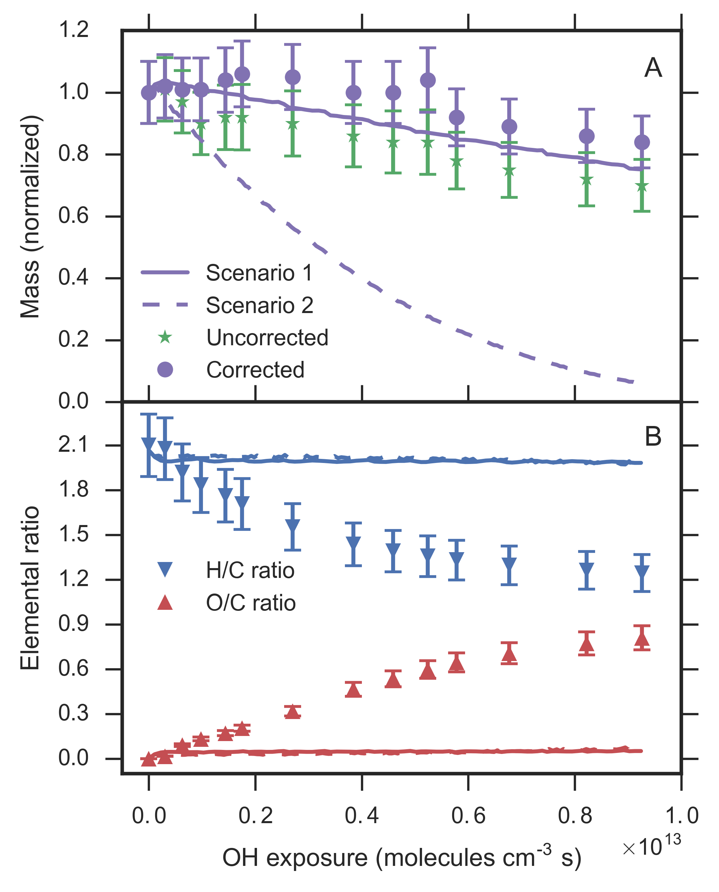
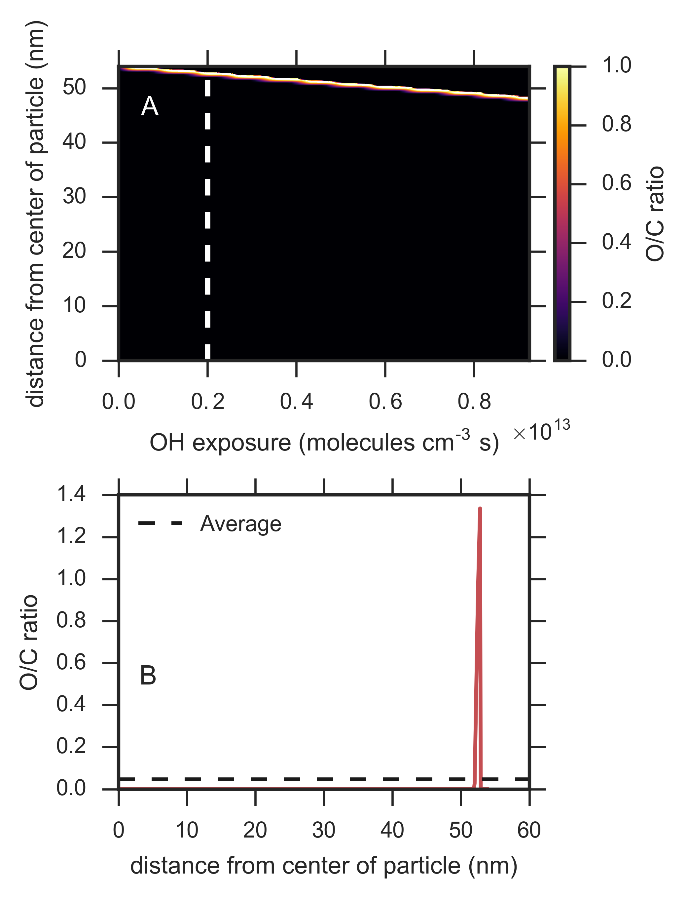

## Python Code for data analysis

These scripts have been developed to analyze data from Kinetiscope simulations exported as XML. 
The simulations are a stack of rectangular prisms used to represent a radial core of a spherical aerosol nanoparticle.
The code can pull out average properties of the aerosol or provide contour maps of the internal distribution. See the rendered Jupyter notebook using [nbviewer](http://nbviewer.jupyter.org/github/aawiegel/StackSimAnalysis/blob/master/python/Postprocessing.html).

## Quick start

Run Triacontane_scenarioplot.py to load the data, and then any plotting script (e.g., contour_presentation.py).

## Files

### StackSim.py

Generic simulation and compartment classes used to represent the simulated data. The current implementation 
assumes a stack of compartments (see above), but could easily be extended for a full 3D treatment. The classes
contain generic methods for calculating average properties, species sums, and species ratios. For example,
a list of species associated with oxygen atoms and a list of species associated with carbon atoms can each be 
summed. Then, the ratio of oxygen to carbon atoms in the aerosol can be calculated to be compared to aerosol
mass spectometer data.

### Triacontane_scenarioplot.py

This script imports StackSim and then loads in scenario data from a dictionary that contains the scenario names and 
file names. Then, the data is preprocessed by applying radial corrections to various species to account for the change
in simulation geometry. The preprocessed data is then available in a dictionary for easy access and comparison between
different model scenarios.

### Example plots

The script mass_elemratio_plot.py plots the mass and elemental ratios for two sets of scenarios. The script produces a plot that looks
like the following: 

The internal distribution of species in the aerosol can also be plotted using contour_presentation.py. The script produces a plot of the O/C ratio inside the aerosol that looks like the following: 

